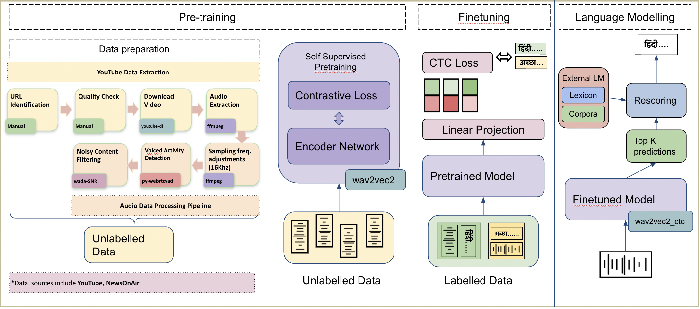

# IndicWav2Vec

IndicWav2Vec is a multilingual speech model pretrained on 40 Indian langauges. This model represents the largest diversity of Indian languages in the pool of multilingual speech models. We fine-tune this model for downstream ASR for 9 languages and obtain state-of-the-art results on 3 public benchmarks, namely MUCS, MSR and OpenSLR.

As part of IndicWav2Vec we create largest publicly available corpora for 40 languages from 4 different language families. We also trained state-of-the-art ASR models for 9 Indian languages.



## Benchmarks
We evaluate our models on 3 publicly available benchmarks MUCS, MSR and OpenSLR and below mentioned are our results

|Model    | gu   | ta   | te   | gu   | hi   | mr   | or   | ta   | te   | bn   | ne   | si   |
| ------- | ---- | ---- | ---- | ---- | ---- | ---- | ---- | ---- | ---- | ---- | ---- | ---- |
|IndicW2V | 20.5 | 22.1 | 22.9 | 26.2 | 16.0 | 19.3 | 25.6 | 27.3 | 29.3 | 16.6 | 11.9 | 24.8 |
|IndicW2V + LM| 11.7 | 13.6 | 11.0 | 17.2 | 14.7 | 13.8 | 17.2 | 25.0 | 20.5 | 13.6 | 13.6 | - |


## Updates
21 June 2022

```
Added more documentation
```


## Table of contents
- [IndicWav2Vec](#indicwav2vec)
  - [Benchmarks](#benchmarks)
  - [Updates](#updates)
  - [Table of contents](#table-of-contents)
  - [Resources](#resources)
    - [Download Models](#download-models)
    - [Hosted API Usage](#hosted-api-usage)
    - [Accessing on ULCA](#accessing-on-ulca)
  - [Quick start](#quick-start)
    - [Python Inference](#python-inference)
    - [Huggingface Inference](#huggingface-inference)
  - [Tutorials](#tutorials)
    - [Setting up your environment](#setting-up-your-environment)
    - [Pretraining](#pretraining)
      - [Data preparation](#data-preparation)
      - [Manifest Creation](#manifest-creation)
    - [Training procedure and code](#training-procedure-and-code)
    - [Finetuning](#finetuning)
      - [Data preparation](#data-preparation-1)
      - [Finetuning procedure and code](#finetuning-procedure-and-code)
      - [Finetuning procedure and code](#finetuning-procedure-and-code-1)
    - [Language Modelling (LM)](#language-modelling-lm)
      - [Data preparation](#data-preparation-2)
      - [Training details](#training-details)
    - [Evaluating ASR models](#evaluating-asr-models)
    - [Model exporting](#model-exporting)
    - [Deployment](#deployment)
  - [Cite](#cite)
  - [License](#license)
  - [Contributors](#contributors)
  - [Contact](#contact)
## Resources

### Download Models
Finetuned Models
|Language |Acoustic Model | Dictionary | Language Model | Lexicon | Wandb |
| - | - |  - | - | - | - |
| Bengali | [fairseq](https://storage.googleapis.com/indicwav2vec-public/fine-tuning-ckpts/bengali_large.pt) \| [[hf]]()| [link]() |  [KenLM](https://storage.googleapis.com/indicwav2vec-public/language-models/bengali.zip) | [link](https://storage.googleapis.com/indicwav2vec-public/language-models/bengali.zip) | [link]() |
| Gujarati | [fairseq](https://storage.googleapis.com/indicwav2vec-public/fine-tuning-ckpts/gujarati_large.pt) / [hf]() | [link]() |  [KenLM](https://storage.googleapis.com/indicwav2vec-public/language-models/guharati.zip) | [link](https://storage.googleapis.com/indicwav2vec-public/language-models/guharati.zip) | [link]() |
| Hindi | [fairseq](https://storage.googleapis.com/indicwav2vec-public/fine-tuning-ckpts/hindi_large.pt) / [hf]() | [link]() |  [KenLM](https://storage.googleapis.com/indicwav2vec-public/language-models/hindi.zip) | [link](https://storage.googleapis.com/indicwav2vec-public/language-models/hindi.zip) | [link]() |
| Marathi | [fairseq](https://storage.googleapis.com/indicwav2vec-public/fine-tuning-ckpts/marathi_large.pt) / [hf]() | [link]() |  [KenLM](https://storage.googleapis.com/indicwav2vec-public/language-models/marathi.zip) | [link](https://storage.googleapis.com/indicwav2vec-public/language-models/marathi.zip) | [link]() |
| Nepali | [fairseq](https://storage.googleapis.com/indicwav2vec-public/fine-tuning-ckpts/nepali_large.pt) / [hf]() | [link]() |  [KenLM](https://storage.googleapis.com/indicwav2vec-public/language-models/nepali.zip) | [link](https://storage.googleapis.com/indicwav2vec-public/language-models/nepali.zip) | [link]() |
| Odia | [fairseq](https://storage.googleapis.com/indicwav2vec-public/fine-tuning-ckpts/bengali_large.pt) / [hf]() | [link]() |  [KenLM]() | [link]() | [link]() |
| Tamil | [fairseq](https://storage.googleapis.com/indicwav2vec-public/fine-tuning-ckpts/odia_large.pt) / [hf]() | [link]() |  [KenLM](https://storage.googleapis.com/indicwav2vec-public/language-models/odia.zip) | [link](https://storage.googleapis.com/indicwav2vec-public/language-models/odia.zip) | [link]() |
| Telugu | [fairseq](https://storage.googleapis.com/indicwav2vec-public/fine-tuning-ckpts/telugu_large.pt) / [hf]() | [link]() |  [KenLM](https://storage.googleapis.com/indicwav2vec-public/language-models/telugu.zip) | [link](https://storage.googleapis.com/indicwav2vec-public/language-models/telugu.zip) | [link]() |
| Sinhala | [fairseq](https://storage.googleapis.com/indicwav2vec-public/fine-tuning-ckpts/sinhala_large.pt) / [hf]() | [link]() |  [KenLM]() | [link]() | [link]() |


Pretrained Model(*)
|Name |Model Checkpoint | 
| - | - |  
| IndicWav2Vec Large | [fairseq](https://storage.googleapis.com/indicwav2vec-public/pretraining-ckpts/indicwav2vec-large.pt) | 
| IndicWav2Vec Base | [fairseq](https://storage.googleapis.com/indicwav2vec-public/pretraining-ckpts/indicwav2vec-base.pt) | 

(* Trained on 40 Indian Languages, more details can be found [here](https://www.aaai.org/AAAI22Papers/AAAI-12428.JavedT.pdf))


### Hosted API Usage
Our models are hosted at the following API end points. 
| Langugage| Language Code | API End point |
| - | - | - |
| Bengali | bn | [https://34.65.180.101:5000/infer_ulca_bn](https://34.65.180.101:5000/infer_ulca_bn) |
| Gujarati | gu | [https://34.65.180.101:5000/infer_ulca_gu](https://34.65.180.101:5000/infer_ulca_gu) |
| Hindi | hi | [https://216.48.182.174:4999/infer_ulca_hi](https://216.48.182.174:4999/infer_ulca_hi) |
| Marathi | mr| [https://34.65.180.101:5000/infer_ulca_mr](https://34.65.180.101:5000/infer_ulca_mr) |
| Nepali | ne| [https://34.65.180.101:5000/infer_ulca_ne](https://34.65.180.101:5000/infer_ulca_ne) |
| Odia | or| [https://34.65.180.101:5000/infer_ulca_or](https://34.65.180.101:5000/infer_ulca_or) |
| Tamil | ta| [https://34.65.180.101:5000/infer_ulca_ta](https://34.65.180.101:5000/infer_ulca_ta) |
| Telugu | te| [https://34.65.180.101:5000/infer_ulca_te](https://34.65.180.101:5000/infer_ulca_te) |
| Sinhala | si| [https://34.65.180.101:5000/infer_ulca_si](https://34.65.180.101:5000/infer_ulca_si) |


Input API data format
```
{
    "config": {
        "language":{
          "sourceLanguage": "#Language Code"
        },
        "transcriptionFormat": {"value":"transcript"},
        "audioFormat": "wav"
    },
    "audio": [{
        "audioContent": "#BASE64 Encoded String"
    }]
}

OR

{
    "config": {
        "language":{
          "sourceLanguage": "#Language Code"
        },
        "transcriptionFormat": {"value":"transcript"},
        "audioFormat": "wav"
    },
    "audio": [{
        "audioUri": "#HTTP/GS path to file"
    }]
}

```

Output
```
{
    "output": [
        {
            "source": "सेकेंड स्टेप इस देसी है स्पेसिफाइड फॉरेस्ट राइट"
        }
    ],
    "status": "SUCCESS"
}
```

### Accessing on ULCA
Our models can be directly accessed on [ULCA](https://bhashini.gov.in/ulca/model/explore-models) by going into ASR section and filtering models by IndicWav2Vec.


## Quick start
### Python Inference
- Greedy Decoding
    ```
    python sfi.py [--audio-file AUDIO_FILE_PATH] 
              [--ft-model FT_MODEL] 
              [--w2l-decoder viterbi]
    ```
- KenLM Decoding
    ```
    python sfi.py [--audio-file AUDIO_FILE_PATH]   
              [--ft-model FT_MODEL_PATH] 
              [--w2l-decoder kenlm] 
              [--lexicon LEXICON_PATH] 
              [--kenlm-model KENLM_MODEL_PATH]
              [--beam-threshold BEAM_THRESHOLD] 
              [--beam-size-token BEAM_SIZE_TOKEN] 
              [--beam BEAM_SIZE] 
              [--word-score WORD_SCORE] 
              [--lm-weight LM_WEIGHT]
              [--unk-weight UNK_WEIGHT] 
              [--sil-weight SIL_WEIGHT] 
              [--nbest NBEST]

    ```

### Huggingface Inference
- Coming soon


## Tutorials
### Setting up your environment
- Setting up conda environment
  ```
  conda create -n <env_name>
  conda activate <env_name>
  ```
- Installing/Updating Libraries
  ```
  sudo apt-get install liblzma-dev libbz2-dev libzstd-dev libsndfile1-dev libopenblas-dev libfftw3-dev libgflags-dev libgoogle-glog-dev
  sudo apt install build-essential cmake libboost-system-dev libboost-thread-dev libboost-program-options-dev libboost-test-dev libeigen3-dev zlib1g-dev libbz2-dev liblzma-dev ffmpeg

   pip install -r requirements.txt

   pip install packaging soundfile swifter editdistance omegaconf
  ```
- Installing Fairseq
  ```
  git clone https://github.com/pytorch/fairseq
  cd fairseq
  pip install --editable ./

  #[Optional for faster training]
  git clone https://github.com/NVIDIA/apex
  
  cd apex

  pip install -v --no-cache-dir --global-option="--cpp_ext" --global-option="--cuda_ext" \
  --global-option="--deprecated_fused_adam" --global-option="--xentropy" \
  --global-option="--fast_multihead_attn" ./
  
  cd ..
  ```
- Installing KenLM
  ```
  git clone https://github.com/kpu/kenlm.git
  cd kenlm
  mkdir -p build && cd build
  cmake .. 
  make -j 16
  cd ..
  export KENLM_ROOT=$PWD
  cd ..
  ```
- Installing Flashlight
  ```
  git clone https://github.com/flashlight/flashlight.git
  cd flashlight/bindings/python
  export USE_MKL=0
  python setup.py install
  ```

### Pretraining

#### Data preparation
- Step 1: Downloading Audio Dataset (Unlabelled)
  ```
  bash dw_util.sh <path_to_urls> <data_store_path> <num_of_threads>
  ```
  The ```<data_store_path>``` refers to the location where the data will be downloaded. The ```<num_of_threads>``` can be used to control the parallelization.
- Step 2: Voiced Activity Detection
  ```
  python vad.py <data_read_dir> <data_write_dir> <folder_name>
  ```
  The ```<data_read_dir>``` is the root of downloaded files which contain downloaded data in language-named-folders.

  The ```<data_write_dir>``` is the location for saving the data after VAD step.

  The ```<folder_name>``` refers to the names of language-named-folder for which you want to perform this VAD step.

  *The reason why folder_name has been kept as a seperate entity is to allow parallelization because one can process multiple folders simultaneously.
- Step 3: SNR Filtering
  ```
  python snr.py <data_path> <folder/language_name>
  ```
  where the ```<data_path>``` refers to the root path containing all the audios in language specific folders. Here it refers to the``` <data_write_dir>``` from the previous step. The ```<folder/language_name>``` refers to name of language_specific folder for which snr_filtering needs to be done. The audio data that is rejected is moved in the folder **"snr_rejected"**, which is created automatically.

- Step 4: Chunking
  ```
  python chunking.py <chunking_path>
  ```
  All the audio files present in the ```<chunking_path>``` will be chunked and saved in the same location. The original files are **removed**.

Or alternatively users can use the one single script ```process_data.sh``` to run the entire pipeline
- Usage: ```bash process_data.sh </path/to/download> <num_of_threads>```
- The ```</path/to/download>``` refers to the location where the data will be downloaded.
- The ```<num_of_threads>``` can be used to control the parallelization.
- Please make sure that the relative path is urls directory is ```../urls``` from the script.

#### Manifest Creation
For creating language-wise pretraining manifest
```
python path/to/lang_wise_manifest_creation.py /path/to/wave/files --dest /manifest/path --ext $ext --valid-percent $valid
```

For ```/path/to/wav/files/``` we expect the directory to have one folder per language under the parent directory

In our pretraing, we use a ```--valid-percent``` as ```0.03```

For creating a combined validation file for all languages, we concatenate all individual ```*_valid.tsv``` files to create a valid.tsv file.
```
import pandas as pd
import glob

filenames = glob.glob("*_valid.tsv")

combined = []
for f in filename:
    df = pd.read_csv(f, skiprows=1, names=['f', 'd'], sep='\t')
    combined.append(df)

df_combined = pd.concat(combined, axis=0, ignore_index=True)
df_combined.to_csv('valid.tsv', index=True, header=False, sep='\t')
```

We then add the ```/path/to/wav/files/``` to the first line of the ```valid.tsv``` file

### Training procedure and code
For pretraining the model we do multi-node training and schedule the runs with slurm.

Following is the invocation script for training IndicWav2Vec base starting from Wav2Vec2.0 English base ckeckpoint
```
fairseq-hydra-train \
  task.data=/path/to/manifest/directory \
  common.wandb_project=<wandb project name> \
  task._name=temp_sampled_audio_pretraining \
  +task.sampling_alpha=0.7 \
  common.log_interval=200 \
  common.log_format=tqdm \
  dataset.max_tokens=3000000 \
  common.user_dir=/path/to/custom_task/directory \
  checkpoint.save_dir=/path/to/save/model/checkpoints \
  checkpoint.restore_file=/path/to wav2vec2-english-base/checkpoint.pt \
  +optimization.update_freq='[2]' \
  optimization.clip_norm=0.5 \
  checkpoint.reset_optimizer=true \
  distributed_training.distributed_world_size=<total GPUs> \
  distributed_training.distributed_port=$PORT \
  --config-dir /path/to/configs/directory \
  --config-name wav2vec2_base_librispeech"
```

For Large model we override the above configuration with

```
  checkpoint.restore_file=/path/to wav2vec2-english-large/checkpoint.pt \
  +optimization.update_freq='[6]' \
  lr_scheduler.warmup_updates=0 \
  --config-name wav2vec2_large_librivox"
```
Configs for both the models are provided in the configs directory

### Finetuning
#### Data preparation
- Sampling correction (if required for a dataset)

  For datasets, that are not sampled uniformly at 16kHz, the user may run the following command to normalize the data first.
  ```
  bash normalize_sr.sh <path/to/the/folder/to/normalize> <ext|wav|mp3>
  ```
- Manifest creation
  - Make a new directory and name it (say ```mucs```)
  - Download and extract the benchmark data inside mucs. The data should be extracted in such a way that each folder inside should contain data for a particular language i.e each language specific folder should contain train, valid and test folder and within them the audio + transcript.txt 
    
    Note that the transcript.txt contain entries of the following type
    ```
    <filename1> <transcript1> #just the filename and not the path
    <filename2> <transcript2>
    <filename3> <transcript3>
    <filename4> <transcript4>
    ...
    ```

    Sample structure of folder tree:
    ```
    mucs(or msr/openslr)
        ├── hindi
        │   ├── test
        │   │   ├── audio
        │   │   └── transcript.txt
        │   ├── train
        │   │   ├── audio
        │   │   └── transcript.txt
        │   └── valid
        │       ├── audio
        │       └── transcript.txt
        └── marathi
            ├── test
            │   ├── audio
            │   └── transcript.txt
            ├── train
            │   ├── audio
            │   └── transcript.txt
            └── valid
                ├── audio
                └── transcript.txt
            .
            .
            .
            .
    ```
  - Creating the manifest
    ```
    bash m_process.sh <path/to/the/root/folder/(mucs)>
    ```
    The  would result in creation of manifest folders in each language specific folder which can the be used with fairseq for finetuning.


#### Finetuning procedure and code
Following is the invocation script for finetuning IndicWav2Vec large on a particular language

```
fairseq-hydra-train \
  task.data=/path/to/finetune/manifest/directory/for/a/particular/language \
  common.wandb_project=<wandb project name> \
  model.w2v_path=/path/to/pretrained/model_large.pt \
  common.log_interval=50 \
  common.log_format=tqdm \
  dataset.max_tokens=1000000 \
  checkpoint.save_dir=/path/to/save/model/fine_tune_checkpoints \
  +optimization.update_freq='[1]' \
  distributed_training.distributed_world_size=<total GPUs> \
  --config-dir /path/to/configs/directory \
  --config-name ai4b_xlsr"
```
For IndicWav2Vec Base model we override the above configuration with

```
  model.w2v_path=/path/to/pretrained/model_base.pt \
  --config-name ai4b_base"
```
Configs for both the models are provided in the [finetune_configs]() directory

#### Finetuning procedure and code


### Language Modelling (LM)
We train 6-grams Statistical LM using [KenLM library](https://kheafield.com/code/kenlm/). 
#### Data preparation
- Prepare training manifest using [fairseq](https://github.com/pytorch/fairseq/tree/master/examples/wav2vec) and copy its path.
- Prepare clean_dump.txt containing ```"\n"``` separated rows of text data. 
- Add ```dict.txt``` containing ```comma(,)``` separated rows of characters and its' index.  
- Add these two files to the ```{lang}``` folder, where ```lang``` denotes the language for which lm is to be trained.
> Command to clean transcripts and prepare lexicon for training:
```
python utils/clean_corpus.py -d=<lm directory path> -l=<lang> --transcript=<speech transcript folder path> --st=<start code of lang> --en=<end code of lang> --top_k=<'k' most frequent words for vocab>
```
#### Training details
> Run lm-training: ```bash scripts/train_lm.sh <lm directory path> <lang>```. 

Ouput will be generate at: ```"<lm directory path>/<lang>"```.

### Evaluating ASR models
- Evaluation using fairseq (infer.py)
  ```

  ```


### Model exporting
 - Huggingface
 - ONNX/Torchscript

### Deployment
 - Server (Flask)
   - Install Flask ```pip install flask flask-cors```
   - Change path for the acoustic models, decoding strategy, language models and lexicon in the Make path changes in ```app/models_dict.json```
   - run server ```python app/flask_dep.py```

 - Server (Torchserve)
   - Coming soon
 - Mobile 
   - Coming soon


## Cite
Please cite out work as:

``` bibtex
@inproceedings{javed2021building,
    title = {Towards Building ASR Systems for the Next Billion Users},
    author = {Tahir Javed and Sumanth Doddapaneni and Abhigyan Raman and Kaushal Santosh Bhogale and Gowtham Ramesh and Anoop Kunchukuttan and Pratyush Kumar and Mitesh M. Khapra},
    booktitle = "Proceedings of the AAAI Conference on Artificial Intelligence",
    year = "2022 (to appear)",
}
```
## License

IndicWav2Vec is [MIT](https://choosealicense.com/licenses/mit/)-licensed. The license applies to all the pretrained, fine-tuned and language models


## Contributors
- Tahir Javed, (IITM, AI4Bharat)
- Sumanth Doddapaneni, (AI4Bharat, RBCDSAI)
- Abhigyan Raman, (AI4Bharat)
- Kaushal Bhogale, (AI4Bharat)
- Gowtham Ramesh, (AI4Bharat, RBCDSAI)
- Anoop Kunchukuttan, (Microsoft, AI4Bharat)
- Pratyush Kumar, (Microsoft, AI4Bharat)
- Mitesh Khapra, (IITM, AI4Bharat, RBCDSAI)

## Contact
- Anoop Kunchukuttan ([anoop.kunchukuttan@gmail.com](mailto:anoop.kunchukuttan@gmail.com))
- Mitesh Khapra ([miteshk@cse.iitm.ac.in](mailto:miteshk@cse.iitm.ac.in))
- Pratyush Kumar ([pratyush@cse.iitm.ac.in](mailto:pratyush@cse.iitm.ac.in))
  
## Acknowledgements
We would like to thank EkStep Foundation for their generous grant which helped in setting up the Centre for AI4Bharat at IIT Madras to support our students, research staff, data and computational requirements. We would like to thank The Ministry of Electronics and Information Technology (NLTM) for its grant to support the creation of datasets and models for Indian languages under its ambitions Bhashini project. We would also like to thank the Centre for Development of Advanced Computing, India (C-DAC) for providing access to the Param Siddhi supercomputer for training our models. Lastly, we would like to thank Microsoft for its grant to create datasets, tools and resources for Indian languages.
