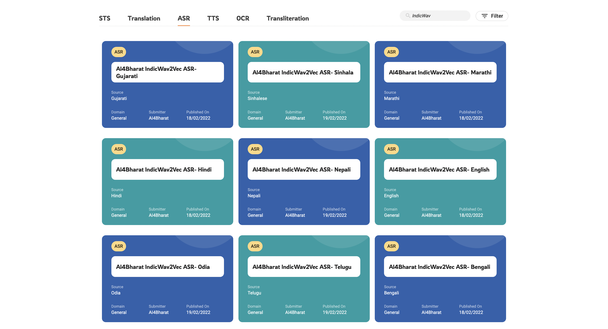

# IndicWav2Vec

IndicWav2Vec is a multilingual speech model pretrained on 40 Indian langauges. This model represents the largest diversity of Indian languages in the pool of multilingual speech models. We fine-tune this model for downstream ASR for 9 languages and obtain state-of-the-art results on 3 public benchmarks, namely MUCS, MSR and OpenSLR.

As part of IndicWav2Vec we create largest publicly available corpora for 40 languages from 4 different language families. We also trained state-of-the-art ASR models for 9 Indian languages.


## Benchmarks
We evaluate our models on 3 publicly available benchmarks MUCS, MSR and OpenSLR and below mentioned are our results

|Model    | gu   | ta   | te   | gu   | hi   | mr   | or   | ta   | te   | bn   | ne   | si   |
| ------- | ---- | ---- | ---- | ---- | ---- | ---- | ---- | ---- | ---- | ---- | ---- | ---- |
|IndicW2V | 20.5 | 22.1 | 22.9 | 26.2 | 16.0 | 19.3 | 25.6 | 27.3 | 29.3 | 16.6 | 11.9 | 24.8 |
|IndicW2V + LM| 11.7 | 13.6 | 11.0 | 17.2 | 14.7 | 13.8 | 17.2 | 25.0 | 20.5 | 13.6 | 13.6 | - |


## Updates
21 June 2022

```
Added more documentation
```


## Table of contents
- [Resources](#resources)
  - [Download models](#download-models)
  - [Using hosted APIs](#using-hosted-apis)
  - [Accessing on ULCA](#accessing-on-ulca)
- [Quick start](#running-inference)
  - [Python Inference](#python-inference)
  - [Huggingface inference](#hugging-face)
- [Tutorials](#training-section)
  - [Setting up your environment](#setting-up-your-environment)
  - [Pretraining](#pretraining)
    - [Data preparation](#preparing-and-processing-data)
    - [Training procedure and code](#training-procedure-and-code)
  - [Finetuning](#finetuning)
    - [Data preparation](#data-processing)
    - [Finetuning procedure and code](#finetuning-procedure-and-code)
    - [Finetuning model on your data](#finetuning-model-on-your-data)
  - [Language modelling](#language-modelling)
    - Data preparation
    - Training details
  - [Evaluating ASR models](#evaluating-trained-model)
  - [Model Exporting]()
    - Huggingface
    - ONNX/Torchscript
  - [Deployment](#deployment)
    - Server (Flask)
    - Server (Torchserve)
    - Mobile (Coming soon..)
- [License](#license)
- [Contributors](#contributors)
- [Contact](#contact)
## Resources

### Download Models
Finetuned Models
|Language |Acoustic Model | Dictionary | Language Model | Lexicon | Wandb |
| - | - |  - | - | - | - |
| Bengali | [fairseq](https://storage.googleapis.com/indicwav2vec-public/fine-tuning-ckpts/bengali_large.pt) \| [[hf]]()| [link]() |  [KenLM]() | [link]() | [link]() |
| Gujarati | [fairseq](https://storage.googleapis.com/indicwav2vec-public/fine-tuning-ckpts/bengali_large.pt) / [hf]() | [link]() |  [KenLM]() | [link]() | [link]() |
| Hindi | [fairseq](https://storage.googleapis.com/indicwav2vec-public/fine-tuning-ckpts/bengali_large.pt) / [hf]() | [link]() |  [KenLM]() | [link]() | [link]() |
| Marathi | [fairseq](https://storage.googleapis.com/indicwav2vec-public/fine-tuning-ckpts/bengali_large.pt) / [hf]() | [link]() |  [KenLM]() | [link]() | [link]() |
| Nepali | [fairseq](https://storage.googleapis.com/indicwav2vec-public/fine-tuning-ckpts/bengali_large.pt) / [hf]() | [link]() |  [KenLM]() | [link]() | [link]() |
| Odia | [fairseq](https://storage.googleapis.com/indicwav2vec-public/fine-tuning-ckpts/bengali_large.pt) / [hf]() | [link]() |  [KenLM]() | [link]() | [link]() |
| Tamil | [fairseq](https://storage.googleapis.com/indicwav2vec-public/fine-tuning-ckpts/bengali_large.pt) / [hf]() | [link]() |  [KenLM]() | [link]() | [link]() |
| Telugu | [fairseq](https://storage.googleapis.com/indicwav2vec-public/fine-tuning-ckpts/bengali_large.pt) / [hf]() | [link]() |  [KenLM]() | [link]() | [link]() |
| Sinhala | [fairseq](https://storage.googleapis.com/indicwav2vec-public/fine-tuning-ckpts/bengali_large.pt) / [hf]() | [link]() |  [KenLM]() | [link]() | [link]() |


Pretrained Model(*)
|Name |Model Checkpoint | 
| - | - |  
| IndicWav2Vec Large | [fairseq](https://storage.googleapis.com/indicwav2vec-public/fine-tuning-ckpts/bengali_large.pt) | 
| IndicWav2Vec Base | [fairseq](https://storage.googleapis.com/indicwav2vec-public/fine-tuning-ckpts/bengali_large.pt) | 

(* Trained on 40 Indian Languages, more details can be found [here](https://www.aaai.org/AAAI22Papers/AAAI-12428.JavedT.pdf))


### Hosted API Usage
Our models are hosted at the following API end points. 
| Langugage| Language Code | API End point |
| - | - | - |
| Hindi | hi | [localhost:4999/infer_ulca_hi](localhost:4999/infer_ulca_hi) |
| Tamil | ta | [localhost:4999/infer_ulca_hi](localhost:4999/infer_ulca_hi) |
| Telugu | te | [localhost:4999/infer_ulca_hi](localhost:4999/infer_ulca_hi) |
| Gujarati | gu| [localhost:4999/infer_ulca_hi](localhost:4999/infer_ulca_hi) |


Input API data format
```
{
    "config": {
        "language":{
          "sourceLanguage": "#Language Code"
        },
        "transcriptionFormat": {"value":"transcript"},
        "audioFormat": "wav"
    },
    "audio": [{
        "audioContent": "#BASE64 Encoded String"
    }]
}

OR

{
    "config": {
        "language":{
          "sourceLanguage": "#Language Code"
        },
        "transcriptionFormat": {"value":"transcript"},
        "audioFormat": "wav"
    },
    "audio": [{
        "audioUri": "#HTTP/GS path to file"
    }]
}

```

Output
```
{
    "output": [
        {
            "source": "सेकेंड स्टेप इस देसी है स्पेसिफाइड फॉरेस्ट राइट"
        }
    ],
    "status": "SUCCESS"
}
```

### Accessing on ULCA
Our models can be directly accessed on [ULCA](https://bhashini.gov.in/ulca/model/explore-models) by going into ASR section and filtering models by IndicWav2Vec.



## Quick start
### Python Inference
- Greedy Decoding
    ```
    python sfi.py [--audio-file AUDIO_FILE_PATH] 
              [--ft-model FT_MODEL] 
              [--w2l-decoder viterbi]
    ```
- KenLM Decoding
    ```
    python sfi.py [--audio-file AUDIO_FILE_PATH]   
              [--ft-model FT_MODEL_PATH] 
              [--w2l-decoder kenlm] 
              [--lexicon LEXICON_PATH] 
              [--kenlm-model KENLM_MODEL_PATH]
              [--beam-threshold BEAM_THRESHOLD] 
              [--beam-size-token BEAM_SIZE_TOKEN] 
              [--beam BEAM_SIZE] 
              [--word-score WORD_SCORE] 
              [--lm-weight LM_WEIGHT]
              [--unk-weight UNK_WEIGHT] 
              [--sil-weight SIL_WEIGHT] 
              [--nbest NBEST]

    ```

### Huggingface Inference
- Coming soon


## Tutorials
### Setting up your environment
- Setting up conda environment
  ```
  conda create -n <env_name>
  conda activate <env_name>
  ```
- Installing/Updating Libraries
  ```
  sudo apt-get install liblzma-dev libbz2-dev libzstd-dev libsndfile1-dev libopenblas-dev libfftw3-dev libgflags-dev libgoogle-glog-dev
  sudo apt install build-essential cmake libboost-system-dev libboost-thread-dev libboost-program-options-dev libboost-test-dev libeigen3-dev zlib1g-dev libbz2-dev liblzma-dev ffmpeg

   pip install -r requirements.txt

   pip install packaging soundfile swifter editdistance omegaconf
  ```
- Installing Fairseq
  ```
  git clone https://github.com/pytorch/fairseq
  cd fairseq
  pip install --editable ./

  #[Optional for faster training]
  git clone https://github.com/NVIDIA/apex
  
  cd apex

  pip install -v --no-cache-dir --global-option="--cpp_ext" --global-option="--cuda_ext" \
  --global-option="--deprecated_fused_adam" --global-option="--xentropy" \
  --global-option="--fast_multihead_attn" ./
  
  cd ..
  ```
- Installing KenLM
  ```
  git clone https://github.com/kpu/kenlm.git
  cd kenlm
  mkdir -p build && cd build
  cmake .. 
  make -j 16
  cd ..
  export KENLM_ROOT=$PWD
  cd ..
  ```
- Installing Flashlight
  ```
  git clone https://github.com/flashlight/flashlight.git
  cd flashlight/bindings/python
  export USE_MKL=0
  python setup.py install
  ```

### Pretraining

#### Data preparation
- Downloading Audio Dataset (Unlabelled)
- Voiced Activity Detection
- SNR Filtering
- Chunking

#### Manifest Creation
For creating language-wise pretraining manifest
```
python path/to/lang_wise_manifest_creation.py /path/to/wave/files --dest /manifest/path --ext $ext --valid-percent $valid
```

For ```/path/to/wav/files/``` we expect the directory to have one folder per language under the parent directory

In our pretraing, we use a ```--valid-percent``` as ```0.03```

For creating a combined validation file for all languages, we concatenate all individual ```*_valid.tsv``` files to create a valid.tsv file.
```
import pandas as pd
import glob

filenames = glob.glob("*_valid.tsv")

combined = []
for f in filename:
    df = pd.read_csv(f, skiprows=1, names=['f', 'd'], sep='\t')
    combined.append(df)

df_combined = pd.concat(combined, axis=0, ignore_index=True)
df_combined.to_csv('valid.tsv', index=True, header=False, sep='\t')
```

We then add the ```/path/to/wav/files/``` to the first line of the ```valid.tsv``` file

### Training procedure and code
For pretraining the model we do multi-node training and schedule the runs with slurm.

Following is the invocation script for training IndicWav2Vec base starting from Wav2Vec2.0 English base ckeckpoint
```
$ sbatch --job-name <NAME> --gres gpu:<N_GPU_PER_NODE> --cpus-per-task <N_CPUS> \
    --nodes <N_NODES> --ntasks-per-node <N_TASKS> \
    --wrap "srun --output train.log.node%t --error train.stderr.node%t.%j \
        $(which fairseq-hydra-train) \
        task.data=/path/to/manifest/directory \
        common.wandb_project=<wandb project name> \
        task._name=temp_sampled_audio_pretraining \
        +task.sampling_alpha=0.7 \
        common.log_interval=200 \
        common.log_format=tqdm \
        dataset.max_tokens=3000000 \
        common.user_dir=/path/to/custom_task/directory \
        checkpoint.save_dir=/path/to/save/model/checkpoints \
        checkpoint.restore_file=/path/to wav2vec2-english-base/checkpoint.pt \
        +optimization.update_freq='[2]' \
        optimization.clip_norm=0.5 \
        checkpoint.reset_optimizer=true \
        distributed_training.distributed_world_size=<total GPUs> \
        distributed_training.distributed_port=$PORT \
        --config-dir /path/to/configs/directory \
        --config-name wav2vec2_base_librispeech"
```

For Large model we override the above configuration with

```
checkpoint.restore_file=/path/to wav2vec2-english-large/checkpoint.pt \
+optimization.update_freq='[6]' \
lr_scheduler.warmup_updates=0 \
--config-name wav2vec2_large_librivox"
```
Configs for both the models are provided in the configs directory

### Finetuning
#### Data preparation
- Sampling correction (if required for a dataset)

  For datasets, that are not sampled uniformly at 16kHz, the user may run the following command to normalize the data first.
  ```
  bash normalize_sr.sh <path/to/the/folder/to/normalize> <ext|wav|mp3>
  ```
- Manifest creation
  - Make a new directory and name it (say ```mucs```)
  - Download and extract the benchmark data inside mucs. The data should be extracted in such a way that each folder inside should contain data for a particular language i.e each language specific folder should contain train, valid and test folder and within them the audio + transcript.txt 
    
    Note that the transcript.txt contain entries of the following type
    ```
    <filename1> <transcript1> #just the filename and not the path
    <filename2> <transcript2>
    <filename3> <transcript3>
    <filename4> <transcript4>
    ...
    ```

    Sample structure of folder tree:
    ```
    mucs(or msr/openslr)
        ├── hindi
        │   ├── test
        │   │   ├── audio
        │   │   └── transcript.txt
        │   ├── train
        │   │   ├── audio
        │   │   └── transcript.txt
        │   └── valid
        │       ├── audio
        │       └── transcript.txt
        └── marathi
            ├── test
            │   ├── audio
            │   └── transcript.txt
            ├── train
            │   ├── audio
            │   └── transcript.txt
            └── valid
                ├── audio
                └── transcript.txt
            .
            .
            .
            .
    ```
  - Creating the manifest
    ```
    bash m_process.sh <path/to/the/root/folder/(mucs)>
    ```
    The  would result in creation of manifest folders in each language specific folder which can the be used with fairseq for finetuning.


#### Finetuning procedure and code
Following is the invocation script for finetuning IndicWav2Vec large on a particular language

```
sbatch --job-name <NAME> --gres gpu:<N_GPU_PER_NODE> --cpus-per-task <N_CPUS> \
    --nodes <N_NODES> --ntasks-per-node <N_TASKS> \
    --wrap "srun --output finetune.log.node%t --error finetune.stderr.node%t.%j \
        $(which fairseq-hydra-train) \
        task.data=/path/to/finetune/manifest/directory/for/a/particular/language \
        common.wandb_project=<wandb project name> \
        model.w2v_path=/path/to/pretrained/model_large.pt \
        common.log_interval=50 \
        common.log_format=tqdm \
        dataset.max_tokens=1000000 \
        checkpoint.save_dir=/path/to/save/model/fine_tune_checkpoints \
        +optimization.update_freq='[1]' \
        distributed_training.distributed_world_size=<total GPUs> \
        --config-dir /path/to/configs/directory \
        --config-name ai4b_xlsr"
```
For IndicWav2Vec Base model we override the above configuration with

```
        model.w2v_path=/path/to/pretrained/model_base.pt \
        --config-name ai4b_base"
```
Configs for both the models are provided in the [finetune_configs]() directory

#### Finetuning procedure and code


### Language Modelling
#### Data preparation
 - To be filled
#### Training details
 - To be filled

### Evaluating ASR models
- To be filled

### Model exporting
 - Huggingface
 - ONNX/Torchscript

### Deployment
 - Server (Flask)
   - Install Flask ```pip install flask flask-cors```
   - Change path for the acoustic models, decoding strategy, language models and lexicon in the Make path changes in ```app/models_dict.json```
   - run server ```python app/flask_dep.py```

 - Server (Torchserve)
   - Coming soon
 - Mobile 
   - Coming soon


## Cite
Please cite out work as:

``` bibtex
@inproceedings{javed2021building,
    title = {Towards Building ASR Systems for the Next Billion Users},
    author = {Tahir Javed and Sumanth Doddapaneni and Abhigyan Raman and Kaushal Santosh Bhogale and Gowtham Ramesh and Anoop Kunchukuttan and Pratyush Kumar and Mitesh M. Khapra},
    booktitle = "Proceedings of the AAAI Conference on Artificial Intelligence",
    year = "2022 (to appear)",
}
```
## License

IndicWav2Vec is [MIT](https://choosealicense.com/licenses/mit/)-licensed. The license applies to all the pretrained, fine-tuned and language models


## Contributors
- Tahir Javed, (IITM, AI4Bharat)
- Sumanth Doddapaneni, (AI4Bharat, RBCDSAI)
- Abhigyan Raman, (AI4Bharat)
- Kaushal Bhogale, (AI4Bharat)
- Gowtham Ramesh, (AI4Bharat, RBCDSAI)
- Anoop Kunchukuttan, (Microsoft, AI4Bharat)
- Pratyush Kumar, (Microsoft, AI4Bharat)
- Mitesh Khapra, (IITM, AI4Bharat, RBCDSAI)

## Contact
- Anoop Kunchukuttan ([anoop.kunchukuttan@gmail.com](mailto:anoop.kunchukuttan@gmail.com))
- Mitesh Khapra ([miteshk@cse.iitm.ac.in](mailto:miteshk@cse.iitm.ac.in))
- Pratyush Kumar ([pratyush@cse.iitm.ac.in](mailto:pratyush@cse.iitm.ac.in))
